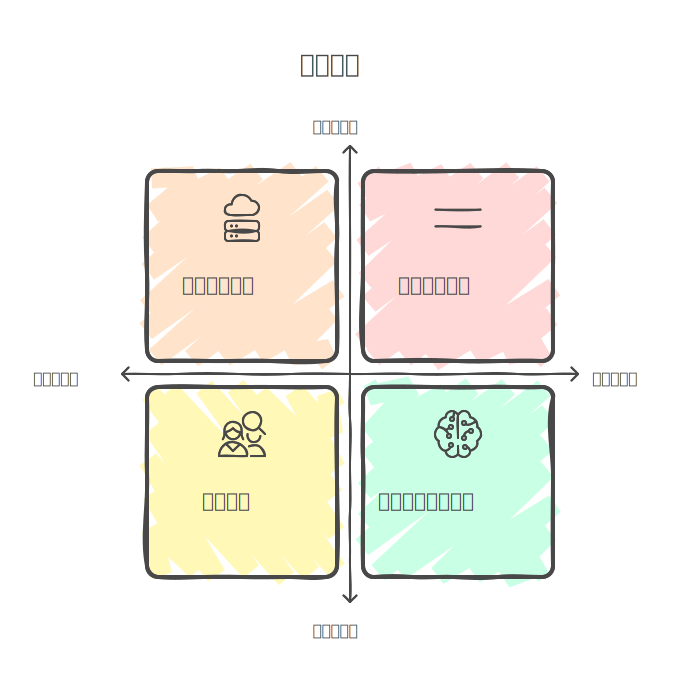

# 如果參與這個訓練，會怎麼安排學習時間？

#### ==雖然畢業了，但我還是想花時間把數學給搞定==

此計畫開始的時間應該是我畢業之後，在此期間我預計邊找工作，邊參與這個訓練。

## **短期 (第一階段、第二階段)**

前兩階段因為數學比重比較多，因此預計會花費大量時間來打基礎。
剩餘時間則是學習其他專業技能。

- 線性代數學習(3HR)
- 神經網路建置學習(2HR)
- 雲端技能或其他學習(2HR)
- 尋找適合工作

## **中期 (第三階段)**

三階段因為是實際運用，對於我來說負擔應該會較輕。因此會加重其他技能學習以及就業。

- 課程專案開發學習
- 其他

---
